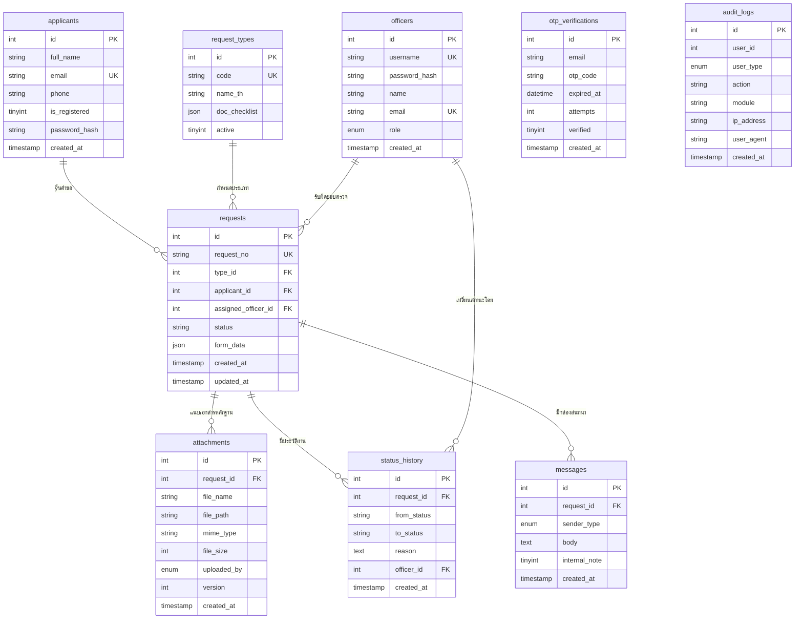

# Entity Relationship Diagram (ER Diagram)

ความสัมพันธ์เชิงความหมายระหว่างตารางข้อมูลต่าง ๆ ในระบบ NWT Document Submission System

```mermaid
erDiagram
    applicants ||--o{ requests : "yื่นคำขอ"
    request_types ||--o{ requests : "กำหนดประเภท"
    officers ||--o{ requests : "รับผิดชอบตรวจ"
    requests ||--o{ attachments : "แนบเอกสารหลักฐาน"
    requests ||--o{ status_history : "มีประวัติงาน"
    requests ||--o{ messages : "มีกล่องสนทนา"
    officers ||--o{ status_history : "เปลี่ยนสถานะโดย"

    applicants {
        int id PK
        string full_name
        string email UK
        string phone
        tinyint is_registered
        string password_hash
        timestamp created_at
    }

    request_types {
        int id PK
        string code UK
        string name_th
        json doc_checklist
        tinyint active
    }

    officers {
        int id PK
        string username UK
        string password_hash
        string name
        string email UK
        enum role
        timestamp created_at
    }

    requests {
        int id PK
        string request_no UK
        int type_id FK
        int applicant_id FK
        int assigned_officer_id FK
        string status
        json form_data
        timestamp created_at
        timestamp updated_at
    }

    attachments {
        int id PK
        int request_id FK
        string file_name
        string file_path
        string mime_type
        int file_size
        enum uploaded_by
        int version
        timestamp created_at
    }

    status_history {
        int id PK
        int request_id FK
        string from_status
        string to_status
        text reason
        int officer_id FK
        timestamp created_at
    }

    messages {
        int id PK
        int request_id FK
        enum sender_type
        text body
        tinyint internal_note
        timestamp created_at
    }

    otp_verifications {
        int id PK
        string email
        string otp_code
        datetime expired_at
        int attempts
        tinyint verified
        timestamp created_at
    }

    audit_logs {
        int id PK
        int user_id
        enum user_type
        string action
        string module
        string ip_address
        string user_agent
        timestamp created_at
    }
```
